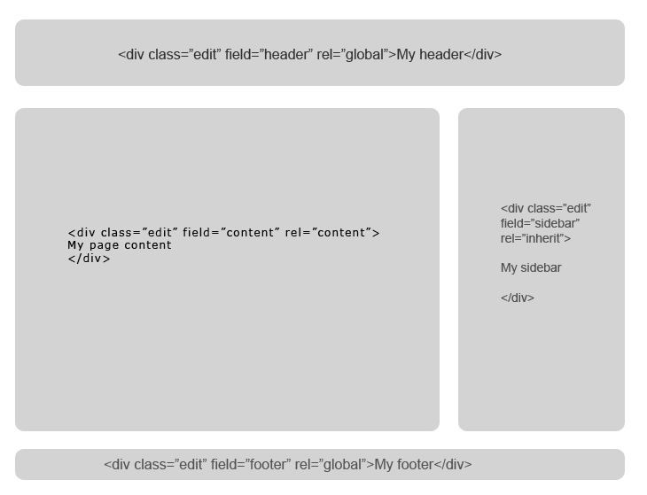

# Template guide


Microweber templates are a set of files that determines the overall look of a website. These files are used to generate the site layout and the html code. 

You can use PHP and HTML to make your template as flexible as you need it to be.


## Template basics
 


All templates are located into `userfiles/templates` directory. Each template is contained within its own folder and you need to create a new folder when creating a new template. Usually, the name of the folder is given the name of your new template.

Template folders must be in lower-case and must not contain spaces or special characters.

Here is the most basic template structure

    userfiles
     /templates
        /my_template
         config.php
         header.php
         index.php
         footer.php
         clean.php

###Basic files and their purpose

|Filename  | Description|
| ------------- | ------------- |
| config.php  | holds the information for  your template, like name, version  |
| index.php  | homepage default layout  |
| header.php  | site header  |
| footer.php  | site footer  |
| clean.php  | default layout for page  |
| inner.php  | default layout for post  |

 	
 	
 
#### config.php
Here is example config file you must create in your template folder

     userfiles/templates/my_template/config.php

####Set template name, author and version

The `config.php` file must contain a `$config` array with the following information.

```php

<?php
$config = array();
$config['name'] = "My template";
$config['author'] = "Your name";
$config['version'] = 0.1;
$config['url'] = "http://example.com/";

```


The config file defines the name of your template as it will appear in the "Template selection" menu and in the "Settings" area.

The version parameter is optional and its used if you want to offer updates.


### Adding CSS and Javascript

In the common case every template have a lot of files, those may be images, css files, javascripts and what not. You can put those files in the template folder and load them in your layout file

To add some basic styling, please create a css/ folder inside your theme folder and add some CSS in css/theme.css 


```html
<!DOCTYPE html>
<html>
    <head>
    <meta charset="utf-8">
    
    <link rel="stylesheet" href="<?php print template_url(); ?>style.css">
    <script type="text/javascript" src="<?php print template_url(); ?>scripts.js"></script>
      
    </head>
    <body>
       ...
    </body>
</html>
```


## Editable regions

The editable regions are the places where the users can drag and drop modules and edit content in real time.

You can define as few or as many regions that you like

Every layout can have many editable regions. 


### How to make editable regions
You can define editable regions in your template where the user will be able to type text and Drag and Drop modules
The content of this region will be dynamic and will be editable on every layout that includes it.

Here is how it looks like:

```html
<div class="edit"  field="your_region_name" rel="content">      
	<p>Edit your content</p>
</div>
```


Simply add class "*edit*" and "*field*" and "*rel*" attributes to ANY html element.
As a developer you can decide how many editable regions you want. They are very flexible and can be re-used across pages.

<div class="mw-ui-box  mw-ui-box-info ">
<div class="mw-ui-box-header">
<span class="mw-icon-info"></span><span>Creating editable field</span>
</div>
<div class="mw-ui-box-content">
<ul>
<li>Add class "edit"</li>
<li>Add "field" attribute</li>
<li>Add "rel" attribute</li>
</ul>
</div>
</div>


 
#### Editable region attributes

Each editable region behaves differently in dependence of the rel and field attributes you add to it

**`field` attribute**
 
The `field` attribute will help you to define multiple content-editable regions in your layout.

Add attribute `field="some_name"` and set the name of your field in your template.
The main content region that the user sees during the "Add content" process must have `field="content"`


**`rel` attribute**

The `rel` attribute is responsible for the "scope" of your content-editable field.  

You can define custom scope and reuse the content of the editable regions across the whole website.

Add attribute rel and set the scope of your field.
* `rel="content"` - changes for every page or post
* `rel="global"` - changes for the whole site
* `rel="page"` - changes for every page and sub-page
* `rel="post"` - changes for every post
* `rel="inherit"` - changes for every main page, but not is sub-pages and posts
* `rel="your_custom_rel"` you can define your own scope

##### other attributes

There is optional attribute "rel-id", which allows you to display editable regions that belong to another content

 
#### Default content region

The default region that shows in the Admin panel is defined by `rel="content"` and  `field="content"` attributes of your html element

 


## Adding modules in your template


You can add a module in your template if you want to show dynamic content or work with some custom functionality 


The modules are added with `<module type="name_of_your_module" />`


### Template constants


|Constant  | Value |
| ------------- | ------------- |
| `TEMPLATE_URL`  | http://example.com/userfiles/templates/my_template/  |
| `TEMPLATE_DIR`  | /home/user/public_html/userfiles/templates/my_template/  |
| `PAGE_ID`  | The id of the current page or 0 if page is not found  |
| `POST_ID`  | The id of the current post or 0 if you are not in a post  |
| `CATEGORY_ID`  | The id of the current category or 0 if you are not in a category  |
| `MAIN_PAGE_ID`  | The id of the parent page if you are in a subpage  |
| `ROOT_PAGE_ID`  | The id of the root parent page if you are in deep sub-page  |


### Template variables
 
| Variable  | Value|
| ------------- | ------------- |
| `$content`  | Array of the current content item, it can be page or post  |
| `$page`  | Array with the data for the current page  |
| `$post`  | Array with the data for the current post  |


 


