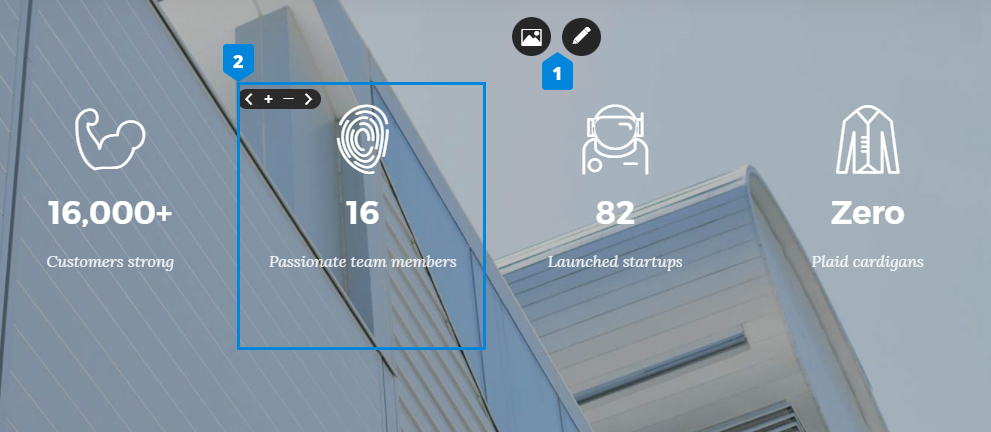
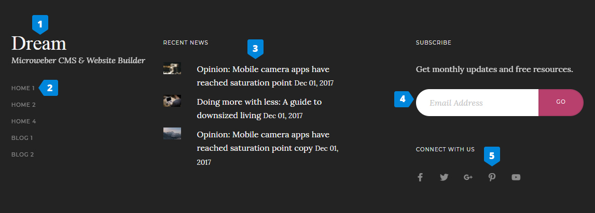
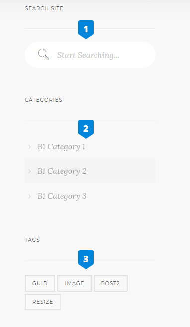
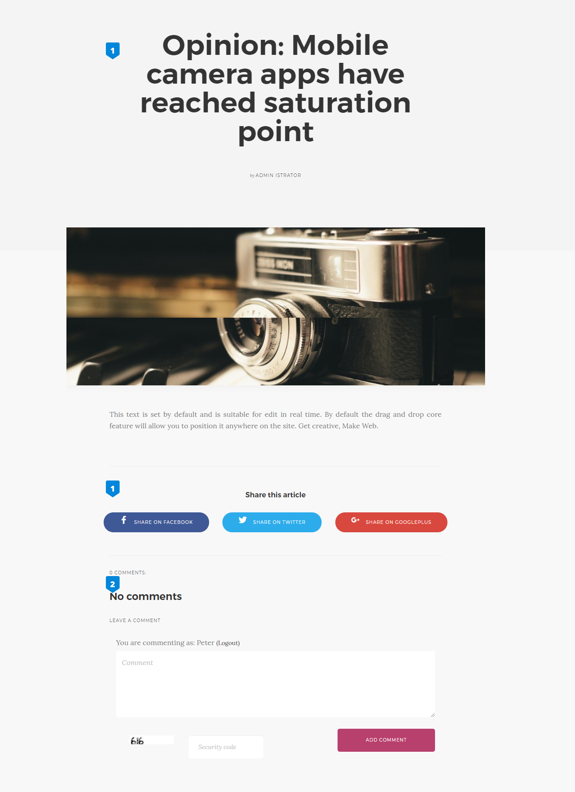
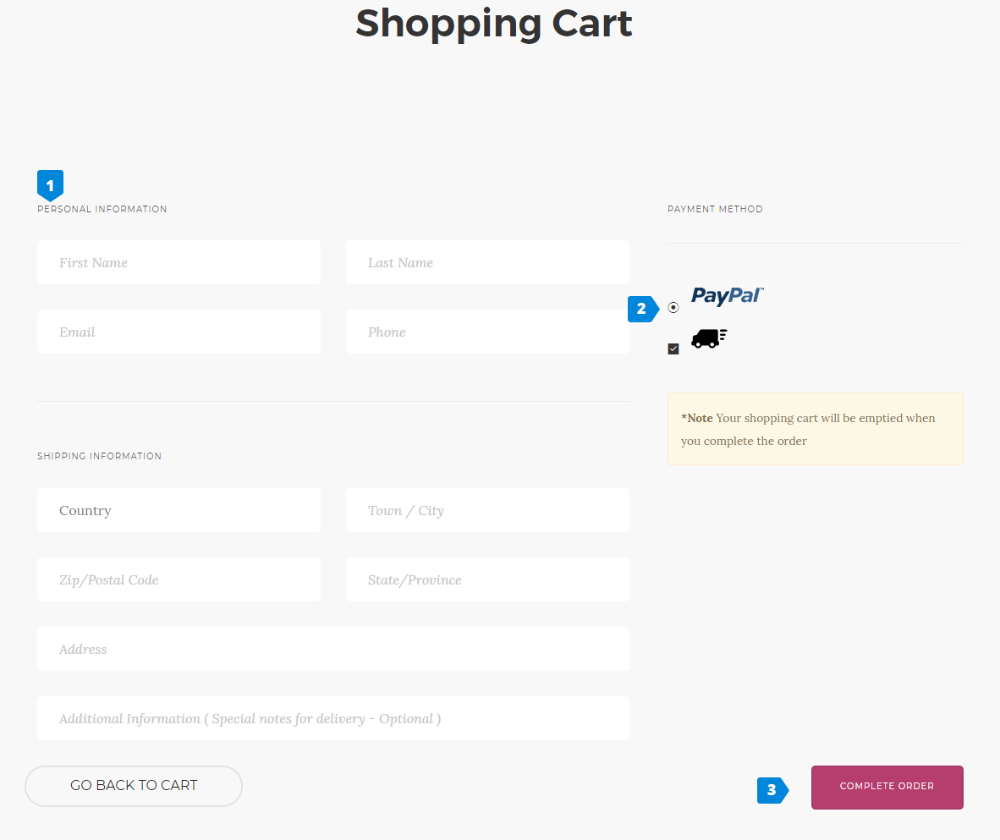
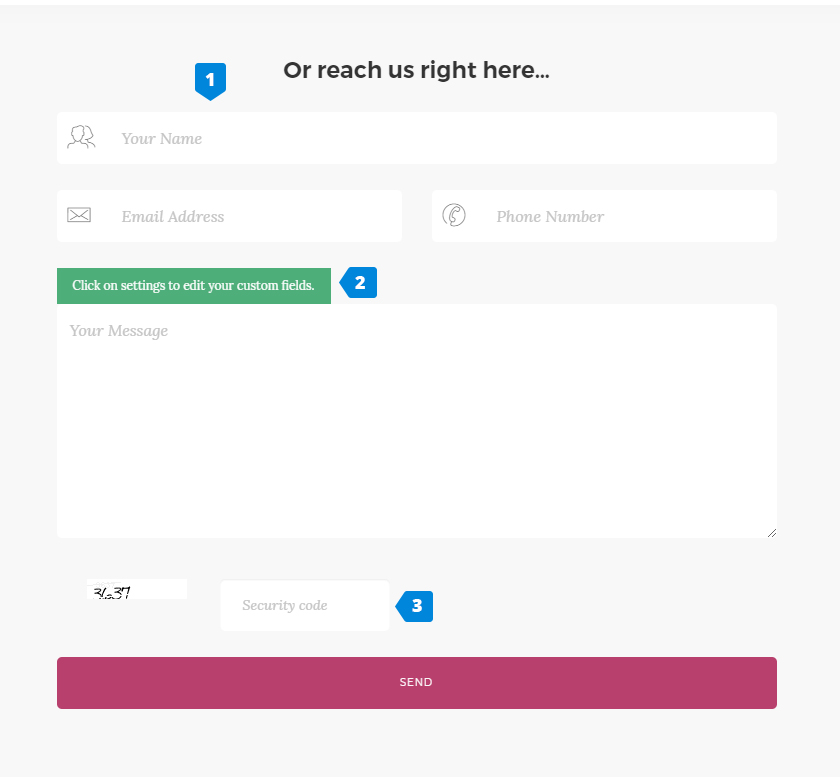

# Example of Dream template structure
## 1. Header

The first example about how exactly dream (default) template was made is the Header.

This part of the website is located in header.php file.

You can see the content here:  [See content](https://github.com/microweber/microweber/blob/1.0.11/userfiles/templates/dream/header.php "")


**Number 1 - Module Logo.** We are creating this element with module "logo". The example for that how to create this element is this part of code: 

```
<module type="logo" id="logo" template="default" default-text="Dream"/>
```

As you suppose the attribute default-text will fill the default text of your module.

For more information about module "logo" here.


**Number 2 - Module Menu.** We are creating this element with the part of code below:

```
<module type="menu" name="header_menu" class="nav-module menu-module left" template="header"/>
```

The attribute template="header" is setting about that how to display the navigation. You can use the module with different styles with the settings "Skin".

For more information about module "menu" click [here](https://documentation.microweber.com/menu "").

**Number 3 - Simple text.** This is a simple text which can be editable.

The part of code for this element is:

```
<div class="nav-module right hidden-xs hidden-sm hidden-md safe-mode">
    <span class="nav-function phone-header edit safe-element" rel="global" field="dream_header_phone" style="">
        <?php _lang("Call us", "templates/dream"); ?>: +1 555 666
    </span>
</div>
```

You can define scope for the edit field with **rel="global"** and **field="dream_header_phone"** where field must be with prefix template_name_ and must be uniq for the page. You must also add the class **edit** on the scoped element.

As you see we are using the class "safe-mode" on the wrapper to prevent the breaking of structure of the element.  


**Number 4 - Search form.** On number four you see the link which open the modal with "Search" form.

```
<form class="clearfix" action="<?php print site_url(); ?>search.php" method="get">
     <div class="input-with-icon">
          <i class="icon-Magnifi-Glass2 icon icon--sm"></i>
           <input type="search" name="keywords" placeholder="<?php _lang("Type your search and hit enter", "templates/dream"); ?>"/>
     </div>
</form>
```

You can also use module "search".  For example: 

```
<module type="search" />
```

**Number 5 - Link.** On number five you see link which points to "Profile page".

```
<a href="<?php print profile_url(); ?>" class="nav-function">
    <i class="fa fa-user"></i><span>Profile</span>
</a>
```

**Number 6** is link which open the sidebar with module "shop/cart".

```
<div class="notification pos-right pos-top cart-overview" data-notification-link="cart-overview" data-animation="from-right">
    <module type="shop/cart" template="small"/>
</div>
```

[Learn more about module "shop"  ](# "")

## 2. Layout with modules


The content of the file for the layout above is on address: [see file](https://github.com/microweber/microweber/blob/1.0.11/userfiles/templates/dream/modules/layouts/templates/skin-1.php "")

**Number 1 - Change image.** On this number you see function which allows you to change the background of the element.

The background is defined with inline styles. For example: 

```
<div class="background-image-holder" style="background-image: url('<?php print template_url('assets/img/'); ?>hero1.jpg');"></div>
```

When you set background-image with inline style on element, microweber detects that you want to use "Change image" functionality for this element.


**Number 2 - Simple text.** This element is just simple text using as logo. It is in editable area, which means that you can edit it.


**Number 3 - Module Button.** Whith this module you can manage the settings of the buttons.

Example for how to use Module "btn" is:

```
<module type="btn" text="<?php _lang("Watch video", "templates/dream"); ?>" />
```

[Learn more about module "btn"](# "")

**Number 4 - Social icons.** This is module "social_links". Example of using it:

```
<module type="social_links" id="socials"/>
```

## 3. Another layout


Link to content of this layout is [here](https://github.com/microweber/microweber/blob/1.0.11/userfiles/templates/dream/modules/layouts/templates/skin-4.php "")


Number 1 is the same like Number 1 from previous section.

Number 2 is block with cloneable columns.

```
<div class="row wide-grid">
    <div class="col-sm-3 col-xs-6 cloneable">
         <div class="feature feature-1 text-center">
            <i class="icon icon--lg icon-Bodybuilding safe-element"></i>
            <h3>16,000+</h3>
            <span class="safe-element"><em><?php _lang("Customers strong", "templates/dream"); ?></em></span>
        </div>
    </div>

    <div class="col-sm-3 col-xs-6 cloneable">
        <div class="feature feature-1 text-center">
            <i class="icon icon--lg icon-Fingerprint safe-element"></i>
            <h3>16</h3>
            <span class="safe-element"><em><?php _lang("Passionate team members", "templates/dream"); ?></em></span>
        </div>
    </div>

    <div class="col-sm-3 col-xs-6 cloneable">
        <div class="feature feature-1 text-center">
            <i class="icon icon--lg icon-Astronaut safe-element"></i>
            <h3>82</h3>
            <span class="safe-element"><em><?php _lang("Launched startups", "templates/dream"); ?></em></span>
        </div>
    </div>

    <div class="col-sm-3 col-xs-6 cloneable">
        <div class="feature feature-1 text-center">
            <i class="icon icon--lg icon-Cardigan safe-element"></i>
            <h3><?php _lang("Zero", "templates/dream"); ?></h3>
            <span class="safe-element"><em><?php _lang("Plaid cardigans", "templates/dream"); ?></em></span>
        </div>
    </div>
</div>
```

As you see of each column you have "cloneable" class. This class will show you the handles for changeing the order of elements, duplicate elements and remove elements.

## 4. Layout with Post module


In this layout we are using the Module "post" for showing Blog posts.

```
<module type="posts" limit="3"/>
```

[#](Learn more about module "posts"   "")

## 5. Footer


The file is located in [github](https://github.com/microweber/microweber/blob/1.0.11/userfiles/templates/dream/footer.php "").

On number **1, 3 and 5** you see modules which I explained above on the page.

**Number 2** is navigation. We are showing the navigation with module "menu". The difference between navigation on header and navigation in footer is that we are using difference templates for module. More about module "menu" you can find [here](../menu "").


On **number 4** is shown the module "newsletter". 


Example for the module is:

```
<module type="newsletter" id="footer-newsletter"/> 
```

## 6. Blog Sidebar



The content of blog_sidebar.php is located on this [link](https://github.com/microweber/microweber/blob/1.0.11/userfiles/templates/dream/layouts/blog_sidebar.php "").

```
<div class="edit" field="template_name_blog_sidebar" rel="inherit">
    <div class="sidebar allow-drop">
        <div class="sidebar__widget">
            <h6><?php _lang("Search Site", "templates/dream"); ?></h6>
            <hr>
            <module type="search" data-search-type="blog" />
        </div>

        <div class="sidebar__widget">
            <h6><?php _lang("Categories", "templates/dream"); ?></h6>
            <hr>

            <module type="categories" template="skin-1" content-id="<?php print PAGE_ID; ?>"/>
        </div>

        <div class="sidebar__widget">
            <h6><?php _lang("Tags", "templates/dream"); ?></h6>
            <hr>
            <module type="tags"/>
        </div>

        <div class="sidebar__widget">
            <h6><?php _lang("About Us", "templates/dream"); ?></h6>
            <hr>
            <p>
                <?php _lang("We're a digital focussed collective working with individuals and businesses to establish rich, engaging online presences.", "templates/dream"); ?>
            </p>
        </div>
    </div>
</div>
```

As you see the sidebar is wrapped in edit field. This means that you can drag & drop everithing in the sidebar. By default we are loaded a few modules. 

On **number 1** is the module "search".

```
<module type="search" data-search-type="blog" />
```

On **number 2** is the module "categories".

```
<module type="categories" template="skin-1" content-id="<?php print PAGE_ID; ?>"/>
```

In this module we are related the categories with the page ID via the attribute "content-id".

You can learn more about the module "categories" on this [link](# "").

On **number 3** is the module "tags".

We are loading the module with this code.

```
<module type="tags"/>
```

## 7. Blog Post


The content of blog_inner.php is located on this [link](https://github.com/microweber/microweber/blob/1.0.11/userfiles/templates/dream/layouts/blog_inner.php "").

```
<?php $post = get_content_by_id(CONTENT_ID); ?>
```

With this part of code, we are getting the content of current post.


Number one is the title. 

We are using ```<?php print content_title(); ?>``` to show the title. 


Number two is the module "sharer".  We are load the module with this code:

```
<module type="sharer" id="share-post"/>
```

Number three is the module "comments".  We are load the module with this code:  

```
<module type="comments" data-content-id="<?php print CONTENT_ID; ?>"/>
```

where with the attribute "data-content-id" we are relating the comments to this post.

## 8. Product inner
You can see the similar product_inner.php (liteness product_inner.php) file on this [link](https://github.com/microweber/microweber/blob/1.0.11/userfiles/templates/dream/layouts/shop_elements/inner_2.php "").


**Number 1** - Title

```
 <h4 class="edit" field="title" rel="content"><?php _e("Product name") ?></h4>
```


**Number 2** - Price & Stock label

```
<div class="item__price" style="margin-bottom: 10px;">
    <span><?php print currency_format(get_product_price()); ?></span>
</div>

<div class="clearfix" style="margin-bottom: 30px;">
    <?php $content_data = content_data(CONTENT_ID);
    $in_stock = true;
    if (isset($content_data['qty']) and $content_data['qty'] != 'nolimit' and intval($content_data['qty']) == 0) {
        $in_stock = false;
    }
    ?>
    <?php if ($in_stock == true): ?>
        <span class="text-success"><i class="fa fa-check"></i> <?php _e("In Stock") ?></span>
    <?php else: ?>
        <span class="text-danger"><i class="glyphicon glyphicon-remove"></i> <?php _e("Out of Stock") ?></span>
    <?php endif; ?>
    <div class="clearfix"></div>
    <?php if (isset($content_data['sku'])): ?>
        <strong><?php _e("SKU") ?>:</strong> <?php print $content_data['sku']; ?>
    <?php endif; ?>
</div>
```

with those rows we are showing the Price, Stock label and the SKU number.

**Number 3** - Custom fields + module "shop/cart"

```
<module type="shop/cart_add"/>
```

**Number 4** - Description

```
<li class="active">
    <div class="tab__title">
        <h6><?php _e('Description'); ?></h6>
    </div>
    <div class="tab__content">
        <div class="edit" field="content_body" rel="content">
            <p><?php _lang("Strategy gamification alpha startup angel investor channels customer direct mailing burn rate churn rate bandwidth innovator seed round. Ramen disruptive graphical user interface. Infrastructure bootstrapping branding leverage twitter channels MVP iPad launch party non-disclosure agreement. Infrastructure validation android release success.", "templates/dream"); ?></p>
        </div>
    </div>
</li>
```

As you see we have a editable field for the description.

**Number 5** - Gallery related to product

```
 <module type="pictures" rel="content" template="skin-2"/>
```

For more information about module "pictures" [here](# "").  

## 9. Layout with Products list and Categories


The file content from the example is located [here](https://github.com/microweber/microweber/blob/1.0.11/userfiles/templates/dream/layouts/shop.php "").

```
<module type="categories" content-id="<?php print PAGE_ID; ?>" />

<module type="shop/products" limit="18" description-length="70"/>
```

Number 1 is module "categories" whic is related with page.

More about this module on this [link](https://documentation.microweber.com/categories "").

Numbers 2,3,4 are module "shop/products". 

More about this module on this [link](# "").

## 10. Layout with Products list and Categories



To see the example click [here](https://github.com/microweber/microweber/blob/1.0.11/userfiles/templates/dream/checkout.php "").

We are loaded the module "shop/checkout".

Example:
```
<module type="shop/checkout" id="cart_checkout"/>
```

More about this module on this [link](# "").  

## 11. Contact form



The layout fron the example is located on this [link](https://github.com/microweber/microweber/blob/1.0.11/userfiles/templates/dream/modules/layouts/templates/skin-47.php "") and the module is located on [this](https://github.com/microweber/microweber/blob/1.1.0/userfiles/templates/dream/modules/contact_form/templates/default.php "").

More about the module "contact_form" on this [link](# "").
